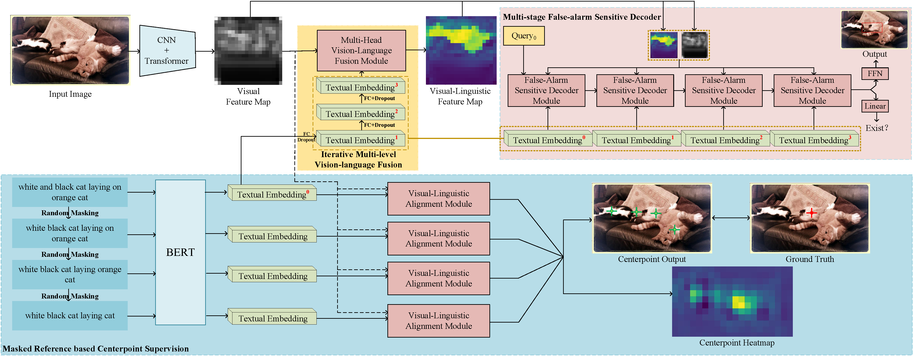

<br />
<p align="center">
  <h1 align="center">Iterative Robust Visual Grounding with Masked Reference based Centerpoint Supervision</h1>
  <p align="center">ICCVW VLAR 2023 Oral Paper
  <p align="center">
    <br />
    <strong>Menghao Li</strong></a>
    ·
    <strong>Chunlei Wang</strong></a>
    ·
    <strong>Wenquan Feng</strong></a>
    ·
    <strong>Shuchang Lyu</strong></a>
    <br />
    ·
    <a href="https://sites.google.com/view/guangliangcheng"><strong>Guangliang Cheng</strong></a>
    ·
    <a href="https://lxtgh.github.io/"><strong>Xiangtai Li</strong></a>
    ·
    <strong>Binghao Liu</strong></a>
    ·
    <strong>Qi Zhao</strong></a>
    <br />
  </p>

## Highlight!!!!

IR-VG: Iterative Robust Visual Grounding

## Abstract

Visual Grounding (VG) aims at localizing target objects from an image based on given expressions and has made significant progress with the development of detection and vision transformer. However, existing VG methods tend to generate **false-alarm** objects when presented with inaccurate or irrelevant descriptions, which commonly occur in practical applications. Moreover, existing methods fail to capture fine-grained features, accurate localization, and sufficient context comprehension from the whole image and textual descriptions. To address both issues, we propose an Iterative Robust Visual Grounding **IR-VG** framework with Masked Reference based Centerpoint Supervision (MRCS). The framework introduces iterative multi-level vision-language fusion (IMVF) for better alignment. We use MRCS to ahieve more accurate localization with point-wised feature supervision. Then, to improve the robustness of VG, we also present a multi-stage false-alarm sensitive decoder (MFSD) to prevent the generation of false-alarm objects when presented with inaccurate expressions. Extensive experiments demonstrate that IR-VG achieves new state-of-the-art (SOTA) results, with improvements of 25\% and 10\% compared to existing SOTA approaches on the two newly proposed robust VG datasets. Moreover, the proposed framework is also verified effective on five **regular** VG datasets. Codes and models will be publicly at .




## TODO
- [x] Release training and inference codes
- [x] Release PART OF DATASET
- [x] Release ALL DATASET

## IR-VG Dataset
* `IR-VG`:  | [Baidu Drive(pw: irvg)](https://pan.baidu.com/s/1d9PKz7Zv2dWNYEOf0m3KMw). |  [Google Drive](https://drive.google.com/file/d/1C9T2tQM4wQgy6D1Bvi7sesaw2ZLwtbAB/view?usp=sharing) |

## Citation
If you think Tube-Link is helpful in your research, please consider referring Tube-Link:
```bibtex
@inproceedings{li2023iterative,
  title={Iterative Robust Visual Grounding with Masked Reference based Centerpoint Supervision},
  author={Li, Menghao and Wang, Chunlei and Feng, Wenquan and Lyu, Shuchang and Cheng, Guangliang and Li, Xiangtai and Liu, Binghao and Zhao, Qi},
  booktitle={ICCVW},
  pages={4651--4656},
  year={2023}
}

@article{li2023,
  title={Iterative Robust Visual Grounding with Masked Reference based Centerpoint Supervision},
  author={Li, Menghao and Wang, Chunlei and Feng, Wenquan and Lyu, Shuchang and Cheng, Guangliang and Li, Xiangtai and Liu, Binghao and Zhao, Qi},
  journal={arXiv preprint arXiv:2307.12392},
  year={2023},
}
```
